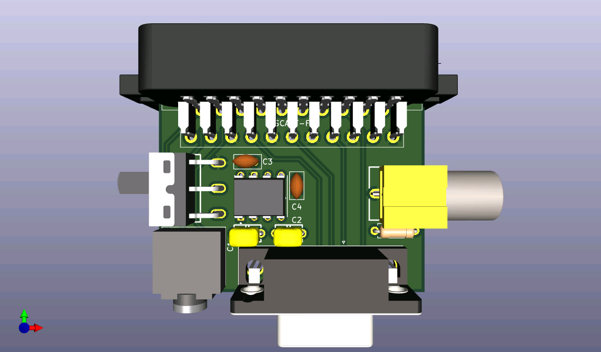

# Disclaimer

This device has been designed by someone that doesn't have a clue about electronics. At this moment, this design has not been tested. If you decide to build it and use it, you do it on your own responisibility.

# MISTER2SCART

This PCB is designed to connect a MiSTer VGA and audio analog output to a SCART RGB device using standard VGA and SCART cables. It includes a switch to set the TV to 4:3 or 16:9, and a RCA connector for lightguns that may require it.

The device is designed for **RGB output only**, it will probably not work with composite or s-video signals.

The device expects **5V from VGA** pin 9, if you use it with a HDMI to VGA dongle in Direct Video, it may  not work, as some of these dongles doesn't provide this voltage.

# Components

You are going to need:

- A female SCART connector like Ninigi SCART-17 , Kycon K-SCARTX-022 or similar. These are getting harder to find on the usual component shops but they are plenty available on Aliexpress.
- A female 3.5mm stereo jack with a footprint similar to SJ1-3523NG or similar. These are available both in component shops and Aliexpress.
- A female RCA connector, with footprint like  BOOMELE AV-5, Kobiconn 156-0098-E, Kycon KLPX-0848-2-BL and similars.
- A 470 Ohms, 1/4W resistor. The PCB is designed for a resistor of 6.3mm length.
- A sliding SPDT switch, I used SS12D10G6-WJ but again, anything with the same footprint should do.
- A MAX662ACPA IC, used to generate 12V for the 4:3 / 16:9 selection. 
- 2x MLCC 220nF 50V ±20% capacitors, with a 5.08mm distance between legs.
- 2x Tantalum 4.7uF 16V ±10%, with a distance of 2.54mm between legs.
- A VGA female connector, with a clearance from the pins to the edge of the PCB of ~3.08mm
